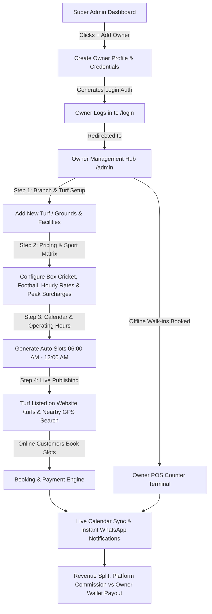

# 🏟️ SportMatrix: Complete Owner Onboarding & Turf Management Workflow

This guide details the complete end-to-end lifecycle of an **Arena Owner** in the SportMatrix ecosystem—from initial creation by the Super Admin to listing grounds, managing hourly slots, POS operations, and receiving automated payouts.

---

## 📋 High-Level Lifecycle Flow



---

## 1️⃣ Step 1: Super Admin Creates the Owner
*Location: Super Admin Portal → `Owner Management` (`/superadmin/owners`)*

1. Super Admin clicks the green **`+ ADD OWNER`** button.
2. Super Admin enters:
   - **Personal Details**: Full Name, Email, Mobile (+91), Alternate Phone.
   - **Initial Security Auth**: Password & Confirmation.
   - **Business Identity**: Company/Entity Name (e.g. *Royal Sports Arena Pvt Ltd*), Entity Type (Proprietorship / LLP / Pvt Ltd), GSTIN & PAN numbers.
   - **HQ / Address**: City (e.g. Indore), State, Postal Code, Address.
   - **Commercial Terms**: Subscription Plan (*Pro Tier / Enterprise Tier*) and agreed **Platform Commission Rate** (e.g. 5% or 10%).
3. On submission, the backend:
   - Creates the user in the database with role `OWNER`.
   - Generates the business profile and assigns permissions.

---

## 2️⃣ Step 2: Owner Login & Workspace Access
*Location: Public Login Page (`/login`)*

1. The Owner opens `/login` and enters their email and password.
2. System verifies the JWT authentication token and detects role `OWNER`.
3. The Owner is redirected to the **Owner Control Suite** (`/admin` or `/owner/dashboard`):
   - **Real-time Metrics**: Today's Revenue, Active Bookings, Slot Occupancy Rate, Commission Balance.
   - **Sidebar Navigation**:
     - 🏟️ **Branch / Turf Management** (`/owner/branches`): Setup & edit turfs.
     - 📅 **Slot & Calendar Engine** (`/owner/slots` & `TurfCalendarPage`): Hourly availability, lockout slots.
     - 💳 **POS Counter Terminal** (`/owner/pos`): Walk-in bookings, offline cash/UPI payments.
     - 🏆 **Tournaments & Leagues** (`/owner/tournaments`): Host weekend knockouts & corporate championships.
     - 👥 **Staff Management** (`/owner/staff`): Assign ground managers and umpires.
     - 💼 **Turf Lead CRM** (`/owner/crm`): Receive and quote corporate & bulk match inquiries.
     - 💰 **Wallet & Payouts** (`/owner/wallet`): View earnings, GST reports, and bank transfers.

---

## 3️⃣ Step 3: How the Owner Adds & Configures a Turf

*Location: Owner Portal → `Branch & Turf Management` (`/owner/branches`)*

When the Owner clicks **`+ ADD NEW TURF / BRANCH`**, they configure their arena across 6 core steps:

### A. Basic Identification
- **Turf Name**: e.g. *Champion Turf Ground*
- **Brand Tagline**: e.g. *Indore's Premier High-Lumen Box Cricket Arena*
- **Primary Sport**: Box Cricket, 7v7 Football, Pickleball, Badminton.

### B. Geo-Location & GPS Pinning
- **City & Region**: Indore, Mumbai, Bangalore, Delhi, Pune, etc.
- **Area / Landmark**: e.g. *Palasia, Near Industry House*.
- **Exact Address**: Full postal address with landmarks.
- **GPS Coordinates**: `Latitude` & `Longitude` (e.g. `22.7244, 75.8839`) used by the system to compute live distances (`🟢 NEAREST (0.8 km)`) for nearby players on the website.

### C. Sports & Hourly Pricing Matrix
- **Supported Sports**: Add multiple sports to a single turf (e.g. Cricket by day, Football by night).
- **Hourly Base Rate**: e.g. ₹800/hour.
- **Peak / Evening Prime Rate**: e.g. ₹1,200/hour (06:00 PM – 11:00 PM).
- **Weekend Surcharge**: Special weekend pricing tiers.

### D. Operating Hours & Slot Generator
- **Operating Window**: e.g. `06:00 AM – 12:00 AM` (or 24x7 Night Leagues).
- **Slot Granularity**: 60-minute, 90-minute, or 120-minute slot units.
- **Slot Automation**: The system automatically generates all daily booking slots across the calendar year.

### E. Arena Amenities & Specifications
- High-Lumen LED Floodlights (500+ Lux for night vision).
- FIFA-Grade 40mm Monofilament Synthetic Turf.
- Air-Conditioned Player Dugouts & Dressing Rooms.
- Hydration Station & Med-Bay / First Aid Kit.
- Live Digital LED Scoreboard & Boundary Nets.
- Cafeteria & Secured Vehicle Parking.

### F. Visual Media & Gallery
- Upload high-resolution cover photos, pitch close-ups, and stadium drone view videos.

---

## 4️⃣ Step 4: Daily Operations & Slot Booking Flow

### Scenario A: Online Customer Booking via Website
1. Customer searches on `/turfs` or opens `/turf/1`.
2. The nearest venue is recommended first using live GPS distance calculation.
3. Customer selects **Date**, **Sport**, and **Slot (e.g. 07:00 PM - 08:00 PM)**.
4. Customer chooses payment option:
   - **Dare to Play**: Winner gets deposit refund; loser pays.
   - **50-50 Split**: Equal share split between team captains.
   - **Per-Player Split**: Each player pays their share.
   - **100% Upfront Online**: Razorpay / UPI / Cards.
5. Slot is locked immediately in the Owner's live Calendar (`TurfCalendarPage.jsx`).
6. Owner & customer receive instant SMS / WhatsApp booking vouchers.

### Scenario B: Walk-in / Offline Booking via Owner POS Counter
1. Walk-in players arrive at the ground without prior website booking.
2. Ground Staff opens **Owner POS** (`/owner/pos`).
3. Selects the date and available slot from the visual slot grid.
4. Enters Player Name & Phone Number.
5. Collects payment via **Cash / Counter UPI QR / Card**.
6. System marks slot as `BOOKED_OFFLINE` so it cannot be double-booked online.

### Scenario C: Corporate & Tournament Proposals
1. Company HR submits a corporate booking inquiry through the **Corporate Proposal Modal**.
2. Super Admin / Owner receives a live notification bell alert.
3. Owner opens **Global CRM** (`/admin/crm`), reviews player count, date, and selected arena.
4. Owner uses **`Set Price Quote`** modal to apply corporate discount, 18% GST invoice terms, and 50% advance requirement.
5. Official quote proposal is dispatched to the corporate client.

---

## 5️⃣ Step 5: Revenue, Commission & Payouts

| Transaction Type | Customer Pays | Platform Commission (e.g. 5%) | Owner Net Payout (95%) | Settlement Mode |
| :--- | :--- | :--- | :--- | :--- |
| **Online Website Booking** | ₹1,200 via Gateway | ₹60 | ₹1,140 | Direct Bank Transfer / Wallet Credit |
| **Offline POS Cash Booking** | ₹1,200 Cash at Turf | ₹60 (Deducted from Owner Wallet) | ₹1,200 kept as Cash | Commission settled via Wallet Balance |
| **Corporate GST Invoice** | ₹70,800 (incl. GST) | Agreed Commission | Net Balance | Direct PO Bank Transfer with GST Credit |

---

## 6️⃣ Role & Permissions Summary

```
┌─────────────────────────────────────────────────────────────────────────────────┐
│                              SUPER ADMIN                                        │
│  - Creates & Suspends Owners                                                   │
│  - Configures Platform Commission & Subscription Tiers                         │
│  - Global CRM, System Logs & Multi-City Analytics                              │
└────────────────────────────────────────┬────────────────────────────────────────┘
                                         │ Onboards
                                         ▼
┌─────────────────────────────────────────────────────────────────────────────────┐
│                              TURF OWNER                                         │
│  - Adds & Configures Multiple Turf Grounds / Branches                           │
│  - Sets Dynamic Hourly Rates, Peak Pricing & Slot Windows                       │
│  - POS Counter for Walk-ins & Cash Management                                   │
│  - Organizes Tournaments, Manages Ground Staff & Umpires                        │
│  - Tracks Earnings, Net Revenue & Wallet Payouts                                │
└────────────────────────────────────────┬────────────────────────────────────────┘
                                         │ Manages
                                         ▼
┌─────────────────────────────────────────────────────────────────────────────────┐
│                              GROUND STAFF / UMPIRES                             │
│  - Daily Slot Check-in & Equipment Issue                                        │
│  - Walk-in Quick Counter Booking                                                │
│  - Live Match Score Verification                                                │
└─────────────────────────────────────────────────────────────────────────────────┘
```
