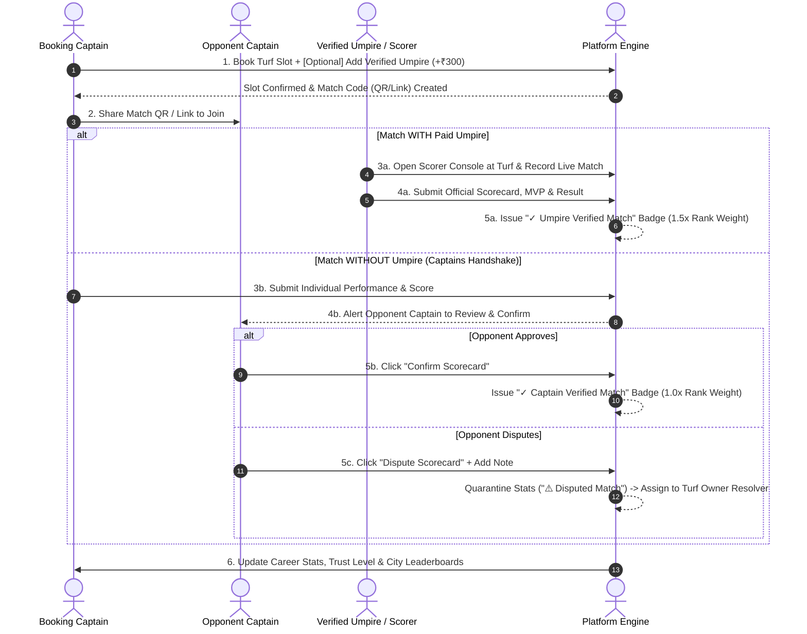

# UI & Architectural Implementation Plan: Tiered Verification Engine & Paid Umpire Ecosystem

## Executive Summary
This document defines the updated end-to-end screen flow logic, database models, and UI architecture for the **Verified Player & Match Record System**.

It integrates a **4-Tier Verification Hierarchy** (Unverified ➔ Captain Verified ➔ Umpire Verified ➔ Official Tournament Verified) and introduces a new revenue-generating **"Add Verified Umpire" (+₹300)** booking add-on.

---

## 🔄 End-to-End System Screen & Logic Flow



---

## 🏆 Tiered Verification Hierarchy & Trust Weighting

| Tier Level | Verification Method | Trust Badge | Ranking Multiplier ($W_{tier}$) | Verification Authority |
| :--- | :--- | :--- | :--- | :--- |
| **Tier 0** | Unverified / Self-Reported | `Unverified Match` | **0.0x** (Excluded from Ranks) | Player Self-Entry |
| **Tier 1** | Captain-to-Captain Handshake | `✓ Captain Verified` | **1.0x** Standard Weight | Opponent Captain Approval |
| **Tier 2** | Platform Paid Umpire Add-on | `✓ Umpire Verified` | **1.5x** High Trust Weight | Verified Umpire at Turf |
| **Tier 3** | Official League / Tournament | `🏆 Tournament Verified` | **2.0x** Maximum Weight | Official Tournament Scorer |

---

## Screen-by-Screen Implementation Details

### Screen 1: Turf Booking Page (`SlotBookingPage.jsx` & `TurfDetailPage.jsx`)
- **New Feature: "Add Verified Umpire" Booking Add-on**:
  - Add an interactive option in Step 1 & Step 3:
    ```jsx
    <div className="bg-emerald-50/70 border-2 border-[#10B981] p-4 rounded-2xl flex items-center justify-between">
        <div className="flex items-center gap-3">
            <div className="w-10 h-10 rounded-xl bg-[#10B981] text-white flex items-center justify-center text-xl font-bold">
                ⚖️
            </div>
            <div>
                <h4 className="text-sm font-black text-[#111827]">Add Verified Umpire & Live Scorer</h4>
                <p className="text-xs text-slate-500 font-medium">Official ball-by-ball scoring, guaranteed 1.5x verified stats & MVP trophy badge</p>
            </div>
        </div>
        <button className="px-4 py-2 bg-[#10B981] text-white font-black text-xs rounded-xl hover:bg-emerald-700">
            + Add ₹300
        </button>
    </div>
    ```
- **Automatic Umpire Assignment**: If selected, the system auto-assigns an available on-duty staff umpire from `StaffManagement.jsx`.

---

### Screen 2: Customer Matches & Handshake Modal (`CustomerMatches.jsx`)
- **Pending Verification Banner**:
  - Highlights unconfirmed matches with countdown timer (48 hours remaining for opponent/umpire verification).
- **Match Score Verification Modal (`MatchScoreVerificationModal.jsx`)**:
  - Displays submitted scorecard: Team A runs/overs vs Team B runs/overs, individual batting/bowling lines.
  - Verification Actions:
    - 🟢 `Approve Scorecard` (Issues `✓ Captain Verified` or `✓ Umpire Verified`).
    - 🔴 `Dispute Scorecard` (Flags match as `⚠️ Disputed` with reason text).

---

### Screen 3: Official Umpire & Live Scorer Console (`CricketScorerConsole.jsx`)
- **Umpire Control Panel**:
  - Live scoring console used by assigned umpires or organizers at `/admin/tournaments/matches` or mobile view.
  - Single-tap Umpire Sign-off: **`Finalize & Issue Umpire Verification Badge ⚖️`**.

---

### Screen 4: Customer Profile & Trust Badge Hub (`CustomerProfile.jsx`)
- **Verification Level Progress Bar**:
  - Level 0 (Guest) ➔ Level 1 (Phone Verified 📱) ➔ Level 2 (Identity Verified 🛡️) ➔ Level 3 (Match Verified ⚡) ➔ Level 4 (Umpire & Tournament Pro 🏆).
- **Dual Stats Tabs**:
  - `✓ Verified Career Stats` (Filtered by Tier 1, Tier 2, Tier 3 matches) vs `Self-Reported Stats`.

---

### Screen 5: City & Turf Leaderboards (`PlayerLeaderboardPage.jsx`)
- **Weighted Player Performance Score (PPS) Formula**:
  $$S_{player} = \left[ (\text{Batting Avg} \times 0.30) + (\text{Batting SR} \times 0.15) + (\text{Wickets/Match} \times 20) + (\text{Economy Rate Factor} \times 10) + (\text{Win Rate \%} \times 0.20) + (\text{MVPs} \times 12) \right] \times W_{tier}$$

---

## User Review Required

> [!IMPORTANT]
> **Paid Umpire Revenue Split**: When a customer adds an Umpire (+₹300), how should the payout be split between Turf Owner and Platform Umpire? Proposal: **70% to Umpire (₹210)**, **30% to Platform/Turf Owner (₹90)**.

> [!NOTE]
> **Umpire Override Power**: If an Umpire is present and submits the scorecard, opposing captains cannot dispute the score; the Umpire's submission is final and instantly verified.

---

## Proposed Changes by Component

### [Component 1: Booking Add-on]
#### [MODIFY] [SlotBookingPage.jsx](file:///c:/Users/91969/OneDrive/Desktop/SportsTurf/sportturf/turf%20Frontend/src/pages/website/SlotBookingPage.jsx)
#### [MODIFY] [TurfDetailPage.jsx](file:///c:/Users/91969/OneDrive/Desktop/SportsTurf/sportturf/turf%20Frontend/src/pages/website/TurfDetailPage.jsx)

### [Component 2: Match Verification & Handshake]
#### [NEW] [MatchScoreVerificationModal.jsx](file:///c:/Users/91969/OneDrive/Desktop/SportsTurf/sportturf/turf%20Frontend/src/components/booking/MatchScoreVerificationModal.jsx)
#### [MODIFY] [CustomerMatches.jsx](file:///c:/Users/91969/OneDrive/Desktop/SportsTurf/sportturf/turf%20Frontend/src/pages/customer/CustomerMatches.jsx)

### [Component 3: Umpire Scoring Integration]
#### [MODIFY] [CricketScorerConsole.jsx](file:///c:/Users/91969/OneDrive/Desktop/SportsTurf/sportturf/turf%20Frontend/src/components/cricket/CricketScorerConsole.jsx)
#### [MODIFY] [TournamentMatchesPage.jsx](file:///c:/Users/91969/OneDrive/Desktop/SportsTurf/sportturf/turf%20Frontend/src/pages/tournaments/TournamentMatchesPage.jsx)

### [Component 4: Profile & Leaderboards]
#### [MODIFY] [CustomerProfile.jsx](file:///c:/Users/91969/OneDrive/Desktop/SportsTurf/sportturf/turf%20Frontend/src/pages/customer/CustomerProfile.jsx)
#### [NEW] [PlayerLeaderboardPage.jsx](file:///c:/Users/91969/OneDrive/Desktop/SportsTurf/sportturf/turf%20Frontend/src/pages/website/PlayerLeaderboardPage.jsx)

---

## Verification Plan

### Automated Verification
- Unit test score submission with and without Umpire add-on.
- Test that Umpire-verified matches apply a `1.5x` multiplier to Player Ranking Points.

### Manual Verification
- Book slot with `+ Add Verified Umpire (+₹300)`.
- Open `CricketScorerConsole.jsx`, complete match, and click **`Finalize & Issue Umpire Verification Badge ⚖️`**.
- Verify `CustomerProfile.jsx` displays `✓ Umpire Verified Match` badge and updated stats.
