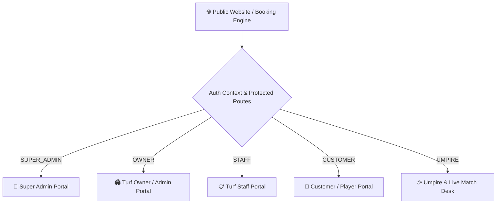
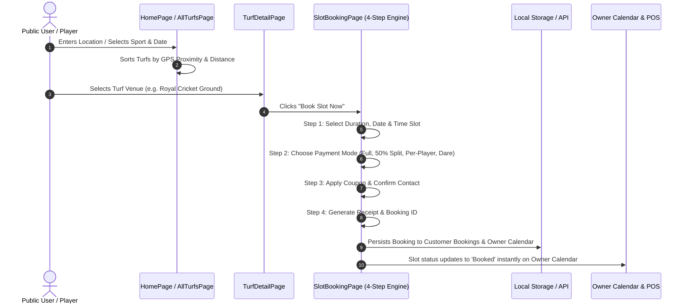
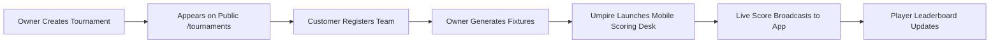
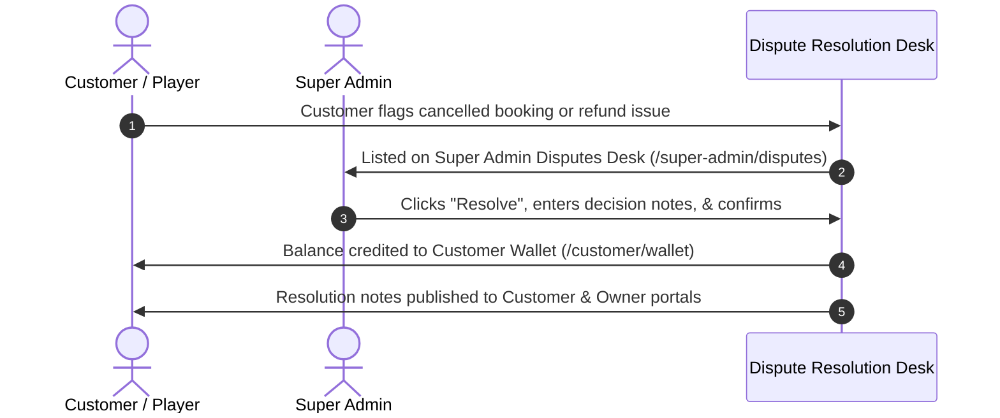

# SportTurf / SportMatrix UI System Workflow & Architecture

Comprehensive guide to the user journeys, role navigation paths, data workflows, and interface architecture of the **SportTurf / SportMatrix** frontend web application.

---

## 1. Architecture & Portals Overview

The application is structured into **5 distinct user portals**, seamlessly connected through role-based routing and centralized state management:

---

## 2. Core User Workflows

### ⚽ Workflow 1: Turf Discovery & Slot Booking Journey

---

### 🏆 Workflow 2: Tournament Management & Live Scoring Journey

1. **Creation**: Turf Owner or Staff opens `/admin/tournaments/create` to set registration fee, format (Knockout/League), and prize pool.
2. **Registration**: Customer browses `/tournaments`, registers their squad via `/customer/teams`, and pays entry fees.
3. **Fixture Generation**: Owner generates brackets and schedules match slots via `/admin/tournaments/fixtures`.
4. **Live Match Operations**: Umpire logs into `/umpire` or opens `/mobile-controller/:sessionId` on mobile. Each ball, run, wicket, and strike swap updates live scoreboards instantly.
5. **Leaderboard**: Match outcome updates individual player statistics (runs, wickets, MVP score) on `/leaderboard`.

---

### 📢 Workflow 3: Advertising & Promo Offer Campaign Flow

1. **Campaign Setup**: Turf Owner or Super Admin visits `/admin/ads` or `/super-admin/ads` and clicks **Create Advertisement**.
2. **Type Selection**:
   * **Guaranteed Booking Ad**: Pays platform commission (% fee) only when slots are booked.
   * **Impression Ad (CPM)**: Places banners on Homepage/Search bar based on impression budget.
3. **Approval & Activation**: Super Admin approves pending ads via `/super-admin/ads`. Active ads display dynamically across the public website.
4. **Analytics**: Owners track CTR (Click-Through Rate), total views, and bookings on `/admin/ads/analytics`.

---

### ⚖️ Workflow 4: Dispute Resolution & Wallet Settlement

---

## 3. Role-Based Navigation & Page Directory

| Role | Accessible Paths | Key Features |
| :--- | :--- | :--- |
| **Public User** | `/`, `/turfs`, `/turfs/:id`, `/booking/:id`, `/tournaments`, `/leaderboard`, `/membership`, `/contact` | Distance-based search, slot availability grid, split-payment booking engine, public leaderboards. |
| **Customer** | `/customer`, `/customer/bookings`, `/customer/teams`, `/customer/matches`, `/customer/tournaments`, `/customer/wallet`, `/customer/profile` | My Bookings, Team squad management, personal match stats, cashbacks & promo wallet. |
| **Turf Owner** | `/admin`, `/admin/sports`, `/admin/calendar`, `/admin/pos`, `/admin/tournaments/*`, `/admin/ads`, `/admin/teams`, `/admin/wallet`, `/admin/reports`, `/admin/inventory`, `/admin/staff` | Full venue operations, rate card configuration, POS billing desk, tournament organizer, ad manager. |
| **Staff** | `/staff`, `/staff/bookings`, `/staff/tournaments/*`, `/staff/refunds`, `/staff/maintenance`, `/staff/equipment` | On-field check-in, ground equipment tracking, slot refund processing, venue maintenance log. |
| **Super Admin** | `/super-admin`, `/super-admin/owners`, `/super-admin/users`, `/super-admin/subscriptions`, `/super-admin/crm`, `/super-admin/ads`, `/super-admin/analytics`, `/super-admin/payments`, `/super-admin/disputes`, `/super-admin/settings` | Platform-wide monitoring, owner onboarding, global lead CRM, dispute arbitration, commission logs. |
| **Umpire** | `/umpire`, `/mobile-controller/:sessionId` | Real-time ball-by-ball scoring desk, player strike swapper, live match score broadcast. |

---

## 4. UI Aesthetic & Design System Standards

* **Color Palette**:
  * **Primary Brand Accent**: Emerald Green (`#16A34A` / `#10B981`)
  * **Highlight / CTA**: Electric Lime (`#C8FF2E`)
  * **Background Neutral**: Clean Slate (`#F8FAFC`) & Dark Onyx (`#0B0F17`)
* **Typography**: Outfit & Inter font families with uppercase italicized headers.
* **Component Patterns**: Glassmorphic cards (`backdrop-blur-md`), ambient radial glows, responsive drawers, and interactive status badges.
